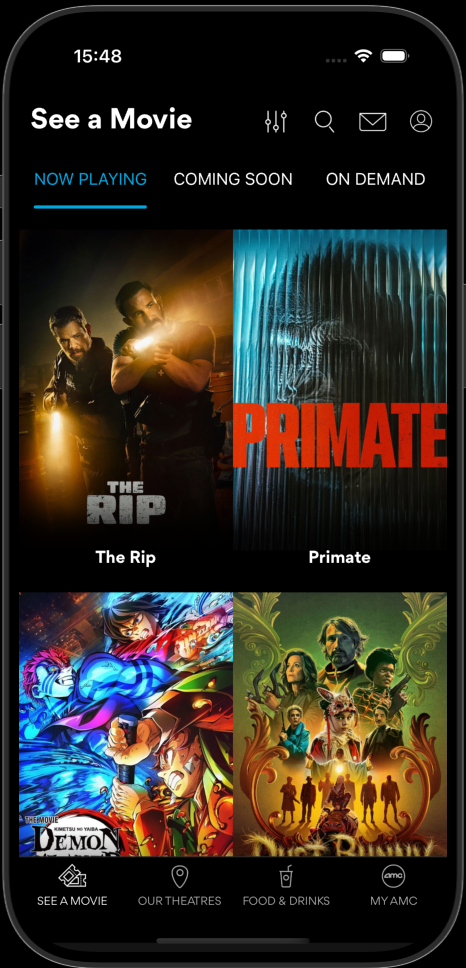
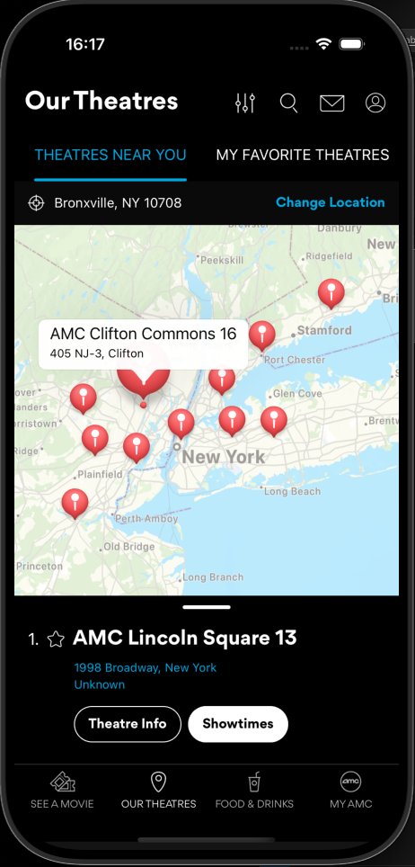
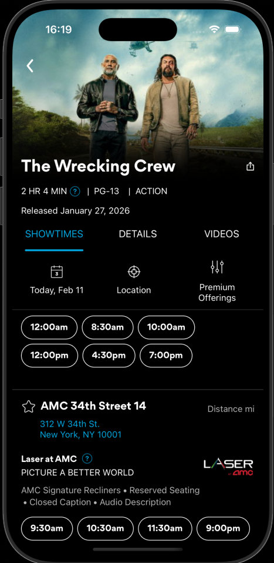
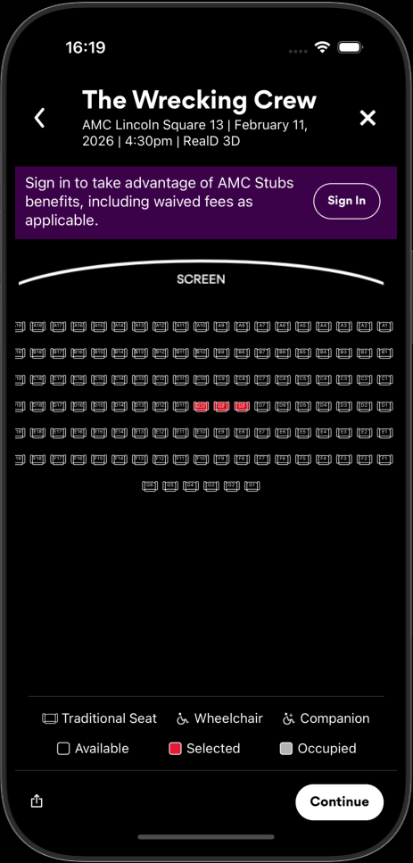
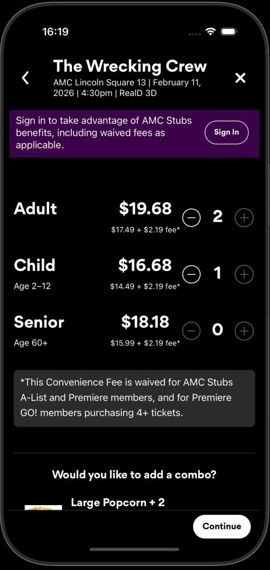
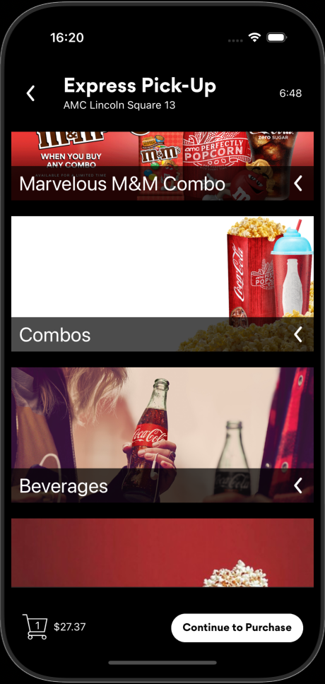
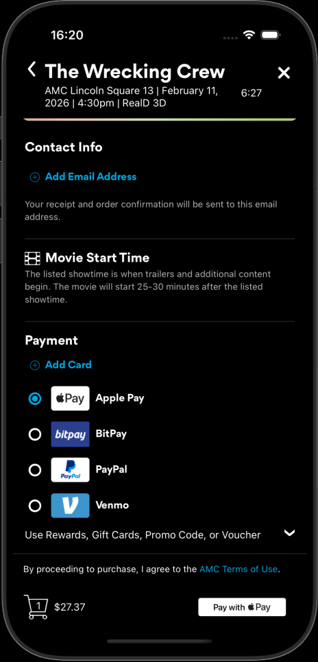
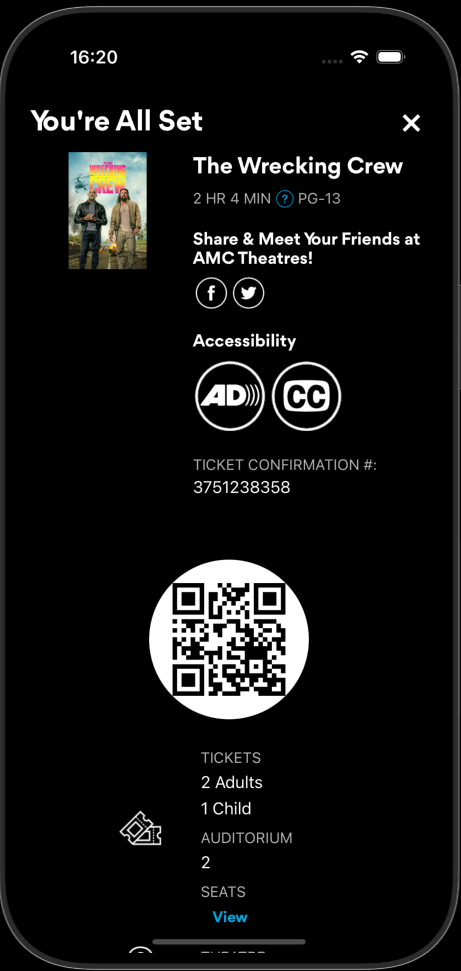
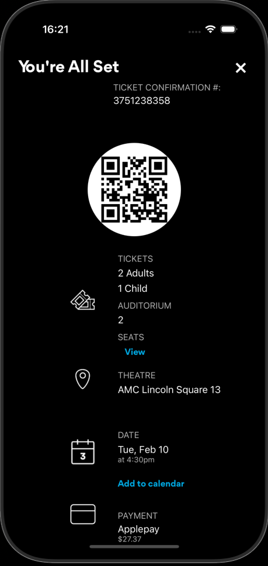

# AMC Clone

A mobile-first React Native movie theater app that replicates core AMC Theaters functionality—browsing movies, selecting showtimes and seats, purchasing tickets and concessions, and managing favorite theater locations. Built as part of the Out of Sight accessibility initiative, designed to integrate with and demonstrate the Tell audio description service for visually impaired moviegoers.

---

## Description

AMC Clone is a cross-platform (iOS, Android, Web) application that enables users to:

- Browse now playing and upcoming movies with poster art and trailers
- Find theaters near them via location services
- Select showtimes, seats, and ticket types (standard/IMAX)
- Add food and drinks (concessions) to their order
- Complete checkout with Stripe-powered payments (card, Apple Pay, Google Pay)
- Save favorite theaters and access express pickup for the concessions

The app uses the TMDB API for movie metadata and integrates with Clerk for authentication, Stripe for payments, and Google Places for theater locations.

---

## Screenshots

### Home & theater discovery

| Home                                                            | Theaters near you                                                 |
| --------------------------------------------------------------- | ----------------------------------------------------------------- |
|  |  |

### Ticket purchase flow

| Showtimes                                                             | Seat selection                                                                  | Ticket type                                                               |
| --------------------------------------------------------------------- | ------------------------------------------------------------------------------- | ------------------------------------------------------------------------- |
|  |  |  |

### Concessions & checkout

| Concessions                                                               | Payment                                                           | You're all set                                                                       | Ticket info                                                                 |
| ------------------------------------------------------------------------- | ----------------------------------------------------------------- | ------------------------------------------------------------------------------------ | --------------------------------------------------------------------------- |
|  |  |  |  |

---

## Tech Stack

| Category      | Technologies                                                |
| ------------- | ----------------------------------------------------------- |
| **Framework** | Expo 54, React Native 0.81, React 19                        |
| **Language**  | TypeScript                                                  |
| **Routing**   | Expo Router (file-based)                                    |
| **Styling**   | NativeWind (Tailwind CSS for React Native)                  |
| **Auth**      | Clerk                                                       |
| **Payments**  | Stripe (React Native SDK + Express backend)                 |
| **APIs**      | TMDB (movies), Google Places (theaters), Expo Location      |
| **UI**        | React Navigation, Bottom Sheet, Reanimated, Gesture Handler |
| **Build**     | Metro bundler, Babel                                        |

---

## Installation

**Prerequisites**

- Node.js 18+
- npm or yarn
- [Expo CLI](https://docs.expo.dev/get-started/installation/) (or use `npx`)
- For iOS: Xcode and iOS Simulator
- For Android: Android Studio and emulator

**Steps**

1. Clone the repository
2. Install dependencies
3. Configure environment variables (see [Configuration](#configuration))
4. Start the development server

---

## Quickstart

Copy and paste into your terminal:

```bash
git clone https://github.com/john-thomas-gray/AMC-clone.git && cd AMC-clone && npm install
```

Configure environment variables (see [Configuration](#configuration))

```bash
npx expo start --clear
```

Then press `i` for iOS Simulator, `a` for Android emulator, or scan the QR code with Expo Go on a physical device.

---

## Usage

| Command                   | Description                                 |
| ------------------------- | ------------------------------------------- |
| `npm start`               | Start Expo dev server                       |
| `npm run ios`             | Run on iOS simulator                        |
| `npm run android`         | Run on Android emulator                     |
| `npm run web`             | Run in web browser                          |
| `npm run lint`            | Run ESLint                                  |
| `npm run generate:assets` | Generate static assets from source          |
| `npm run watch:assets`    | Watch and regenerate assets on file changes |

**Backend (payments)**

For ticket and concession purchases, start the Stripe backend:

```bash
cd backend && STRIPE_SECRET_KEY=sk_... node server.js
```

The server listens on port 4242 and handles `/create-payment-intent` for Stripe PaymentIntents.

---

## Configuration

Create a `.env` file in the project root (never commit secrets):

| Variable                            | Required | Description                        |
| ----------------------------------- | -------- | ---------------------------------- |
| `EXPO_PUBLIC_MOVIE_API_KEY`         | Yes      | TMDB API key (Bearer token)        |
| `EXPO_PUBLIC_GOOGLE_PLACES_API_KEY` | Yes      | Google Places API key for theaters |
| `NEXT_PUBLIC_CLERK_PUBLISHABLE_KEY` | Yes      | Clerk publishable key for auth     |
| `STRIPE_SECRET_KEY`                 | Yes\*    | Stripe secret key (backend only)   |

\*Required only for payment flows.

---

## Project Structure

```
AMC-clone/
├── app/                    # Expo Router screens
│   ├── (tabs)/             # Tab navigation (home, food, myAmc, ourTheatres)
│   └── movies/             # Movie details, ticket flow, payment
├── components/             # Reusable UI (buttons, cards, modals, sheets)
├── context/                # React context (purchases, timers, modals)
├── constants/              # Data and price constants
├── utils/                  # TMDB API, formatters, helpers
├── types/                  # TypeScript definitions
├── assets/                 # Images, fonts
├── backend/                # Express server for Stripe
└── 0reference/             # Reference implementations
```

---

## Testing

Tests are not yet configured. To add testing:

1. Install a test runner (e.g. Jest, Vitest)
2. Add `test` script to `package.json`
3. Add unit tests for `utils/` and `constants/`
4. Add integration tests for critical flows (ticket selection, payment)

---

## Deployment

**Expo (EAS Build)**

```bash
npm install -g eas-cli
eas login
eas build --platform all
```

**Web**

```bash
npm run web
```

Use a static host (e.g. Vercel, Netlify) with the `web` output. Configure environment variables in your hosting provider.

**Backend**

Deploy the `backend/` Express server to any Node.js host (e.g. Railway, Render, Heroku). Set `STRIPE_SECRET_KEY` and ensure the app points to the deployed URL for payment intents.

---

## Contributing

1. Fork the repository
2. Create a feature branch: `git checkout -b feature/your-feature`
3. Commit changes: `git commit -m "Add your feature"`
4. Push to the branch: `git push origin feature/your-feature`
5. Open a Pull Request

Please run `npm run lint` before submitting.

---

## License

See the repository’s LICENSE file for details.

---

## Acknowledgements

- [AMC Theatres](https://www.amctheatres.com/) — This app replicates the AMC Theatres App designs.
- [TMDB](https://www.themoviedb.org/) — Movie data and images (this product uses the TMDB API but is not endorsed or certified by TMDB)
- [Expo](https://expo.dev/) — React Native development platform
- [Stripe](https://stripe.com/) — Payment processing
- [Clerk](https://clerk.com/) — Authentication
